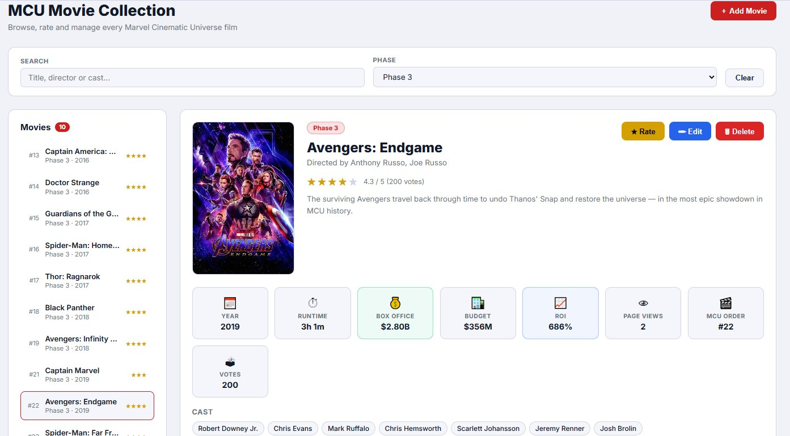
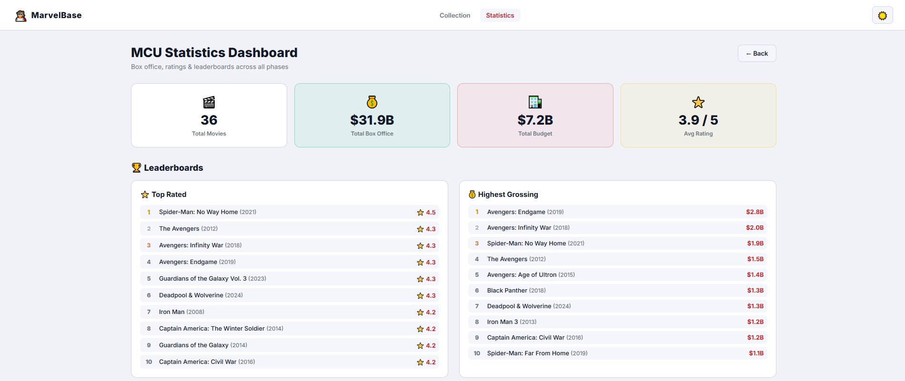
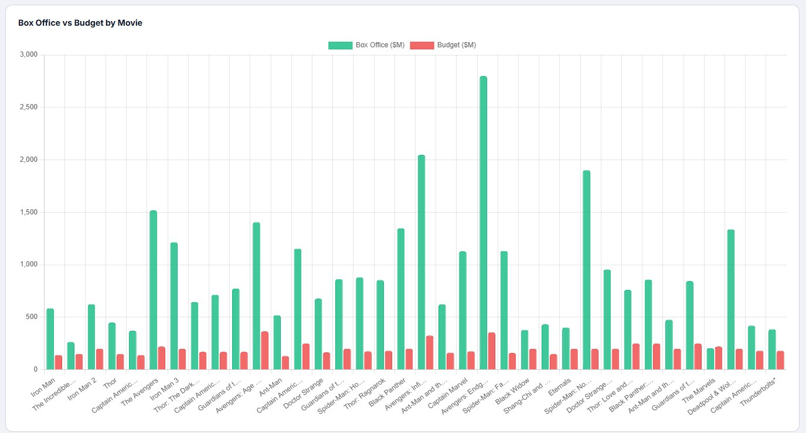
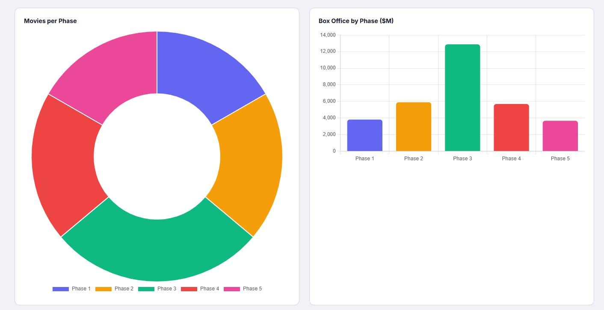
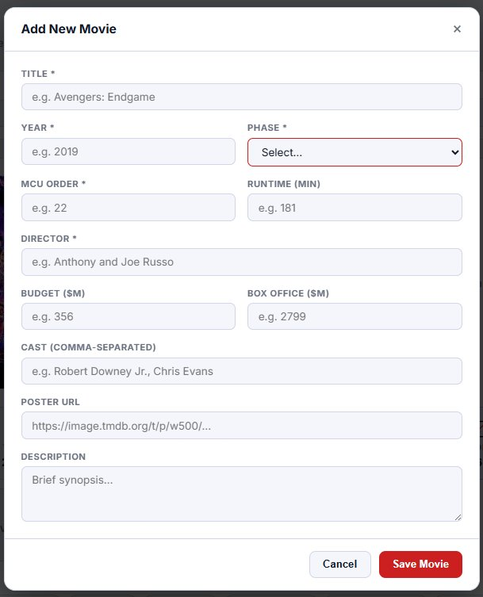

# 🦸 MarvelBase — NoSQL Project (MASTER ADEO2)

A full-stack MVC web application built with **Node.js + Express + MongoDB Atlas** for managing and rating every MCU film.

---

## Screenshots

### 🎬 Collection Page


### 📊 Statistics Dashboard


### 📈 Box Office Chart


### 🥧 Phase Charts


### ➕ Add Movie Modal


---

## Features

- **Browse** all MCU films ordered by release (#1 → #36)
- **Search** by title, director or cast member
- **Filter** by Phase (1–5)
- **View** rich detail panel: poster, synopsis, box office, budget, ROI, cast, runtime, star rating
- **Add / Edit / Delete** movies with full form
- **Rate** movies with a 5-star picker (rolling average auto-updates)
- **Dark / Light mode** toggle (preference saved across sessions)
- **Statistics Dashboard** with:
  - 4 KPI cards (total movies, total box office, total budget, avg rating)
  - 4 Leaderboards (top rated, highest grossing, most viewed, best ROI)
  - 5 Charts: Box Office vs Budget, Avg Rating, Movies per Phase, Box Office by Phase, Top Directors

---

## Architecture (MVC)

```
marvel-nosql/
├── server.js
├── models/
│   └── Movie.js                  ← Model (Mongoose schema + virtuals)
├── controllers/
│   └── movieController.js        ← Controller (business logic)
├── routes/
│   └── movieRoutes.js            ← Routes
├── views/
│   ├── index.ejs                 ← Collection page
│   ├── stats.ejs                 ← Statistics dashboard
│   ├── 404.ejs
│   └── partials/
│       ├── header.ejs            ← Includes dark/light toggle
│       └── footer.ejs
├── public/
│   ├── css/style.css             ← Full dark + light theme
│   └── js/
│       ├── main.js               ← Collection page logic
│       └── theme.js              ← Dark/light toggle
├── seed.js                       ← 36 MCU movies with real data
├── .env.example
└── package.json
```

---

## Setup

### 1. Install dependencies
```bash
npm install
```

### 2. Configure environment
```bash
cp .env.example .env
# Edit .env with your MongoDB Atlas URI
```

### 3. Seed database
```bash
npm run seed
```

### 4. Start server
```bash
npm start          # production
npm run dev        # development (auto-restart)
```

Open **http://localhost:3000** 🎬

---

## Movie Data Model

| Field | Type | Description |
|---|---|---|
| title | String | Movie title |
| year | Number | Release year |
| phase | Number | MCU Phase (1–5) |
| mcuOrder | Number | Release order in MCU |
| director | String | Director(s) |
| runtime | Number | Duration in minutes |
| budget | Number | Production budget ($M) |
| boxOffice | Number | Worldwide gross ($M) |
| cast | [String] | Main cast members |
| description | String | Synopsis |
| posterUrl | String | TMDB poster image URL |
| ratings | [Number] | Array of 0–5 scores |
| views | Number | Page view count |
| *averageRating* | Virtual | Computed mean of ratings |
| *roi* | Virtual | Return on investment % |

---

## API Endpoints

| Method | URL | Description |
|---|---|---|
| GET | `/api/movies` | List all (`?search=&phase=`) |
| GET | `/api/movies/:id` | Get one (increments views) |
| POST | `/api/movies` | Create |
| PUT | `/api/movies/:id` | Update |
| POST | `/api/movies/:id/rate` | Add rating |
| DELETE | `/api/movies/:id` | Delete |
| GET | `/api/stats` | Full stats + leaderboard data |

---

*MASTER ADEO2 — NoSQL Project — 2025*
